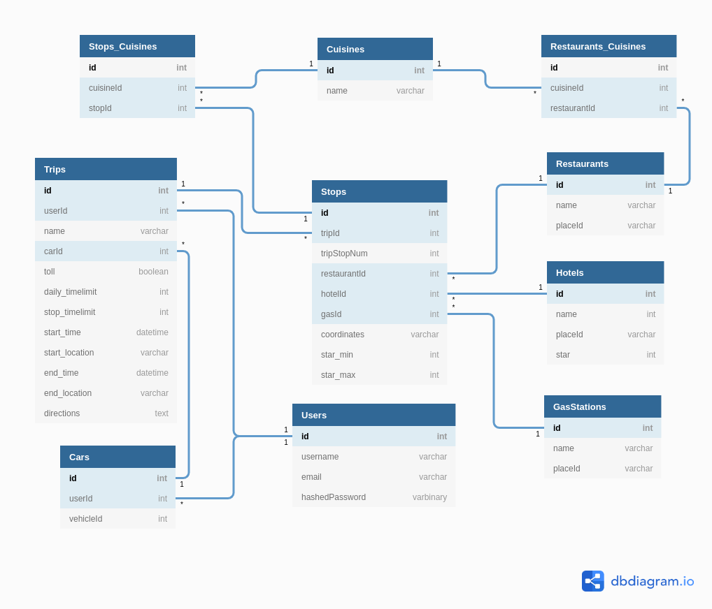

# Road Trip App

Check out the app: [Live Demo](https://triplyroadtripapp.herokuapp.com/)

## Table of Contents

1. [Technologies Used](#technologies-used)
2. [Summary](#summary)
3. [MVP](#mvp)
4. [Front End Routes](#front-end-routes)
5. [Back End Routes](#back-end-routes)
6. [Database Schema](#database-schema)

---

## **Technologies Used**

* React
* Redux
* Google Map API
  * [Distance Matrix API](https://developers.google.com/maps/documentation/distance-matrix/overview)
  * [Places API](https://developers.google.com/places/web-service/overview)
* Fuel Effeciency API
  * [fueleconomy.gov](https://www.fueleconomy.gov/feg/ws/index.shtml)

---

## **Summary**

---

## **MVP**

1. Users

    * User Registration with validations
    * Guest User for demonstration
    * Profile photo
    * Create preferences for restaurants and hotels
    * Add trips, delete trips

2. Trips

    * Map starting point and ending point
    * Decide what time you want to leave or what time you want to arrive
    * Make nodes for stops along the route

3. Suggestions

    * Make suggestions for gas stations, restaurants and hotels
    * Suggestions will be based off of user preferences/car info
    * Make API calls to Google and Federal Government to query info needed

4. Map

    * Displays trip route with stops

---

<!-- ## **Front End Routes**

---

## **Back End Routes**

--- -->

## **Schema**

