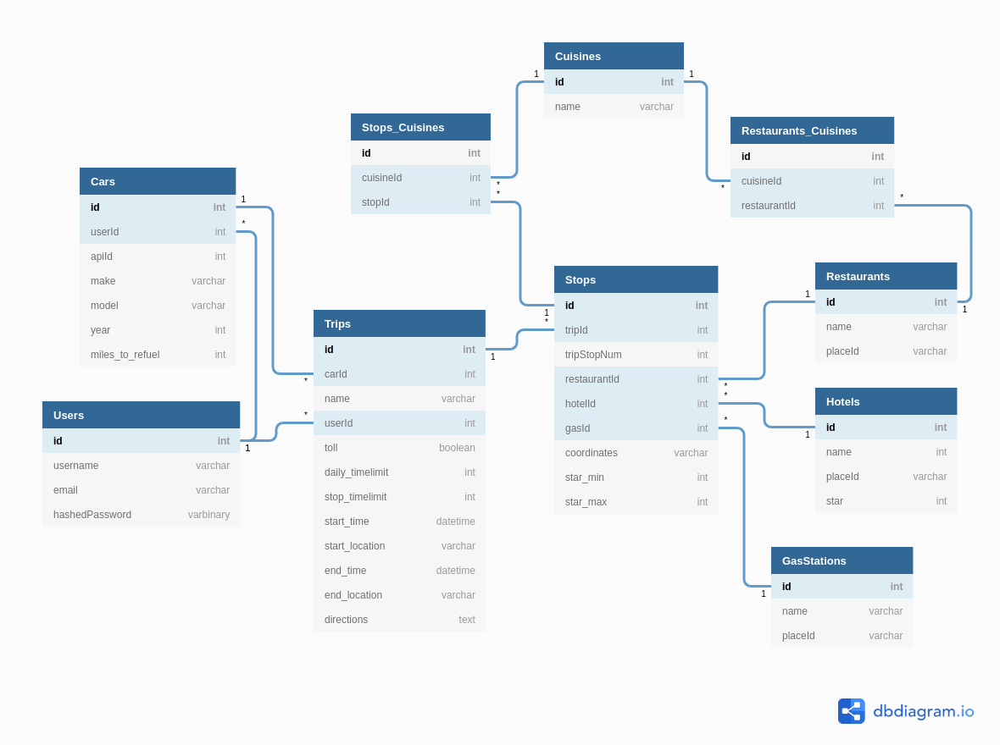

# Road Trip App

Check out the app: [Live Demo](https://triplyroadtripapp.herokuapp.com/)

## Table of Contents

* [Summary](#summary)
* [Features](#features)
* [MVPs](#mvps)
* [Application Structure](#Application-Structure)
* [Database Schema](#database-schema)

---

## **Summary**

* Tripy is an algorithm driven app that makes recommendations for restaurants, gas stations, and hotels based on the user's preferences and proximity to their itinerary.
* Tripy is a single-page web application that utilizes a React, Redux, Flask architecture.

---

## **Features**

Triply allows users to:

* Create an account
* Log in / out
* Add their cars to their profile
* Create a trip

  * Choose their origin and destination
  * Choose which car will be used for the trip
  * Determine how long they would like to drive between stops
  * Determine how long they want to be driving in a day
  * Choose what kind of restaurants they prefer along their trip

* Choose which restaurants, gas stations, and/or hotels they would like to include
* Returns a Google itinerary for their trip that accounts for all the waypoints

---

## **MVPs**

1. Users

    * User Registration with validations
    * Guest User for demonstration
    * Profile photo
    * Create preferences for restaurants and hotels
    * Add trips, delete trips

2. Trips

    * Map starting point and ending point
    * Decide what time you want to leave or what time you want to arrive
    * Make nodes for stops along the route

3. Suggestions

    * Make suggestions for gas stations, restaurants and hotels
    * Suggestions will be based off of user preferences/car info
    * Make API calls to Google and Federal Government to query info needed

4. Map

    * Displays trip route with stops

---

## **Application Structure**

* **Algorithm**

  * Uses Google Maps Directions API to obtain a polyline of the overall trip
  * Determines the location coordinates of where a user will be a specific time intervals along the polyline based off the user's preferences
  * Pings the Google Maps Places API to determine potential restaurants, gas stations, and hotels to offer the user as suggestions
  * Sorts the recommendations by driving proximity to the original route
  
    * This is done as to avoid prioritizing geographically close locations that are out of the way in regards to driving time

  * If the trip exceeds the daily driving limit that the user set, it will make hotel recommendations at the stop closest to the driving limit
  * Based off the choices that the user makes for each stop, determines the next stop location and repeats this process until the destination is reached

* **Back end**

  * The application's back end server was built using Flask and utilizes Flask-SQLAlchemy as the ORM for the PostgreSQL database.
  * It is a RESTful structure that accepts AJAX calls using JSON.
  * The end points and SQL queries were structured to minimize the amount of queries while also being mindful of how the data was structured for Redux.

* **Front end**

  * The front end was built with React and Redux in order to give the user the most responsive experience possible.
  * All data is normalized so that accessing data remains in constant time as well as keeping the code clean and DRY.

* **Technologies**

  * [React.js](https://reactjs.org/)
  * [Redux](https://redux.js.org/)
  * [Python](https://www.python.org/)
  * [Flask](https://flask.palletsprojects.com/en/1.1.x/)
  * [Flask-SQLAlchemy ORM](https://flask-sqlalchemy.palletsprojects.com/en/2.x/)
  * [PostgreSQL](https://www.postgresql.org/)
  * [Google Maps Directions API](https://developers.google.com/maps/documentation/directions/overview)
  * [Google Maps Places API](https://developers.google.com/places/web-service/overview)
  * [Material-UI](https://material-ui.com/)

---

## **Schema**

---

[Return to Table of Contents](#table-of-contents)
